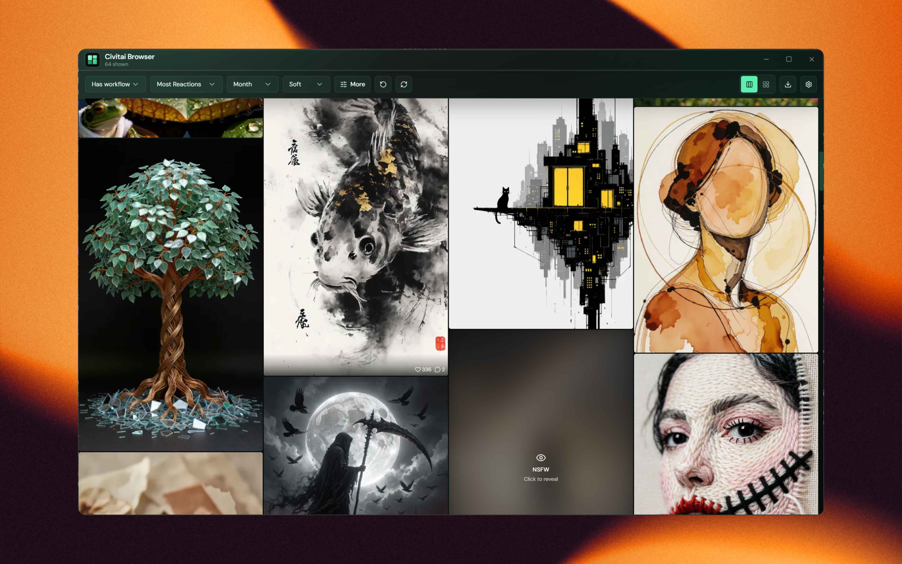

# Civitai Browser

Windows desktop app to browse Civitai images that include generation metadata / ComfyUI workflows, with a masonry gallery and **native drag-out into ComfyUI**.



Repo: [fabwaseem/civitai-browser](https://github.com/fabwaseem/civitai-browser)

## Stack

- Tauri 2 + React 19 + TypeScript + Vite
- Tailwind CSS v4
- TanStack Query + Zustand
- masonic (virtualized masonry)
- `tauri-plugin-drag` for OS file drag into ComfyUI
- `tauri-plugin-updater` for signed updates from GitHub Releases

## Prerequisites

- Node.js 20+ and pnpm
- Rust (rustup) + MSVC Build Tools on Windows
- WebView2 (included on modern Windows 10/11)
- [GitHub CLI](https://cli.github.com/) for releases (`winget install --id GitHub.cli` then `gh auth login`)

## Develop

```bash
pnpm install
pnpm tauri dev
```

## Features

- Filters: sort, period, NSFW, username, model / version ID, base models
- Default **Has workflow** mode (client-side filter + smart pagination fill)
- Virtualized masonry / grid with blurhash placeholders
- Detail panel: models, LoRAs, prompt, negative, workflow JSON
- **Drag an image onto the ComfyUI canvas** (caches original PNG first)
- Download to disk; optional Civitai API token in Settings
- Auto update check on launch + Settings → Check for updates

## One-time updater signing setup

```bash
pnpm tauri signer generate -w %USERPROFILE%\.tauri\civitai-browser.key
```

Put the **public** key into `src-tauri/tauri.conf.json` → `plugins.updater.pubkey` (already set for this repo). Keep the private key offline / local only.

## Release (single command)

After you push your code changes to GitHub:

```bash
# bump patch (0.1.0 → 0.1.1), build, tag, create GitHub Release + latest.json
pnpm release -- --bump patch --notes "What changed"

# or minor / major / exact version
pnpm release -- --bump minor --notes "Theme + logo"
pnpm release -- --version 0.2.0 --notes "Big release"
```

The script will:

1. Bump versions in `package.json`, `tauri.conf.json`, `Cargo.toml`
2. Build a signed NSIS installer + updater artifacts
3. Write `latest.json` for the updater endpoint
4. Commit, tag `vX.Y.Z`, and push
5. Create the GitHub Release and upload installer, `.sig`, and `latest.json`

Useful flags:

| Flag           | Meaning                                |
| -------------- | -------------------------------------- |
| `--skip-build` | Reuse an existing `tauri build` output |
| `--skip-git`   | Don’t commit/tag/push                  |
| `--dry-run`    | Print steps only                       |

Updater endpoint used by the app:

`https://github.com/fabwaseem/civitai-browser/releases/latest/download/latest.json`

### Verify update flow

1. Install an older release (or keep a previous build installed)
2. Run `pnpm release -- --bump patch --notes "Test update"`
3. Launch the older app — within ~2s a mint banner offers **Update now**
4. Or open Settings → **Check for updates**
5. App downloads, installs, and relaunches on the new version

## Notes

- Civitai has no server-side “has workflow” filter. The app requests `withMeta=true` and filters client-side.
- Prefer dragging the cached **original** file into ComfyUI so embedded PNG workflow metadata is preserved.
